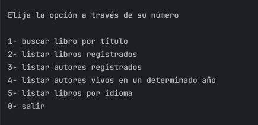
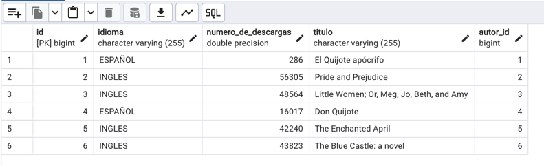
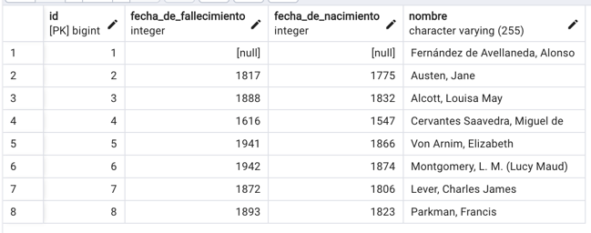

# Gestor de Libros y Autores

## Descripción

Esta aplicación es un sistema de gestión de libros y autores que permite realizar consultas y explorar la información almacenada en una base de datos. Está diseñada para proporcionar una experiencia interactiva a través de un menú de opciones, facilitando la búsqueda de libros, autores y otros datos relacionados.

Además, incorpora datos obtenidos de la API externa Gutendex, lo que permite enriquecer la base de datos con libros populares.

## Características principales

El sistema ofrece las siguientes funcionalidades:

1- Buscar libro por título: Permite al usuario buscar un libro específico ingresando su título. Si el libro no está en la base de datos, se busca en la API externa Gutendex y se registra automáticamente.

2- Listar libros registrados: Muestra todos los libros almacenados en la base de datos.

3- Listar autores registrados: Presenta un listado de los autores registrados, incluyendo detalles como nombre, fecha de nacimiento, fecha de fallecimiento (si aplica) y los libros asociados.

4- Listar autores vivos en un año específico: Filtra y muestra los autores que estaban vivos en un año determinado ingresado por el usuario.

5- Listar libros por idioma: Permite al usuario ver los libros registrados agrupados por idioma.

0- Salir: Finaliza la ejecución del programa.

## Manejo de excepciones

El programa está diseñado para manejar diversas situaciones de error, brindando mensajes claros al usuario:

LibroNoEncontradoExcepcion: Se lanza cuando el usuario busca un libro que no existe en Gutendex o si se ingresó un título inválido.

LibroYaExisteException: Se lanza si el libro que se intenta registrar ya está presente en la base de datos.

Exception: Maneja errores generales como la imposibilidad de recuperar libros o autores desde la base de datos.

InputMismatchException: Se lanza si la fecha ingresada para buscar autores vivos es inválida.

IllegalArgumentException: Se utiliza cuando el idioma ingresado no es válido o no está soportado.

## Requisitos

Java 17+

Base de datos: PostgreSQL (configurada con las tablas Libros y Autores).

IDE: IntelliJ IDEA (recomendado).

## Dependencias:

Spring Data JPA para gestionar la conexión con la base de datos.

Gutendex API para obtener datos de libros externos.

## Estructura de la base de datos

### Tabla Libros:

id: Identificador único del libro.

idioma: Idioma del libro.

numero_de_descargas: Total de descargas.

titulo: Título del libro.

### Tabla Autores:

nombre: Nombre completo del autor.

fecha_de_nacimiento: Fecha de nacimiento del autor.

fecha_de_fallecimiento: Fecha de fallecimiento (si aplica).

Relación con la tabla Libros.

## Instrucciones de instalación

1. Clona este repositorio: 

  - git clone https://github.com/FranGuzGon/ChallengerLiteralura

2. Configura tu base de datos en PostgreSQL según la estructura anterior.

3. Configura las variables de entorno en IntelliJ para conectar con la base de datos:
  - DB_URL: URL de conexión (e.g., jdbc:postgresql://localhost:5432/tu_base_de_datos).
  - DB_USERNAME: Usuario de la base de datos.
  - DB_PASSWORD: Contraseña de la base de datos.

4.  Ejecuta el programa desde tu IDE.

## Guía de uso

Al iniciar la aplicación, se mostrará un menú con las opciones disponibles.

Ingresa el número de la opción deseada.

Sigue las instrucciones según la opción seleccionada:

- Para búsquedas, introduce los parámetros solicitados (e.g., título, idioma o año).
- Los resultados se mostrarán en la consola.
